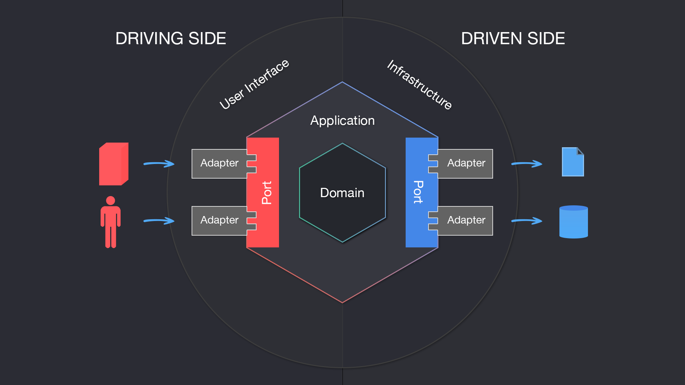
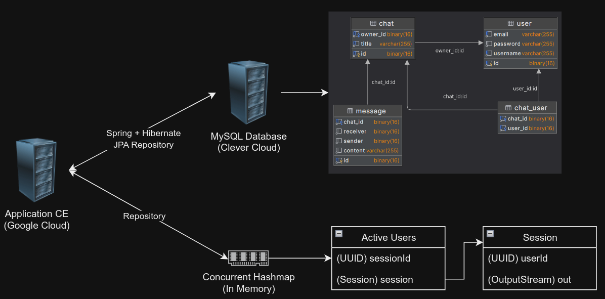
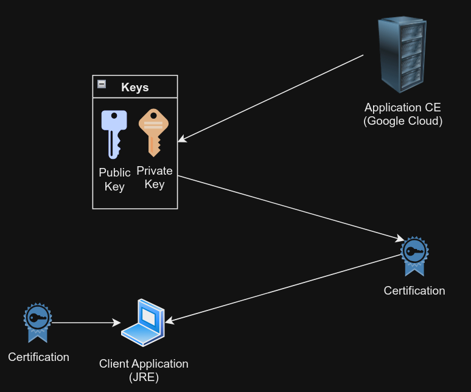
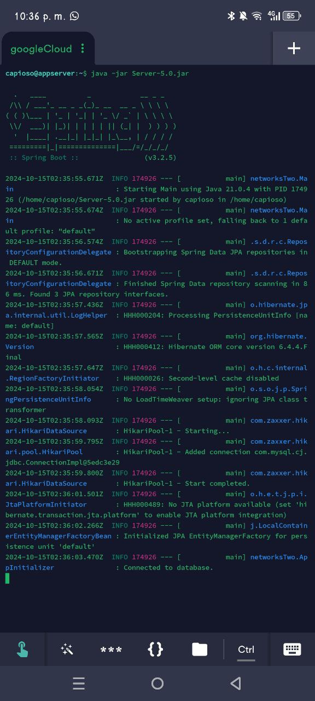

# Server Application
> **Dev:** *_Alexis Hugo Segales Ramoseth_*

# 1. Architecture
For this Capstone,  the expected architecture to develop was the Hexagonal Architecture.



# 2. Versioning
## 2.1. Version 1
> Dumb simple responsive server uploaded.

## 2.2. Version 2
> TLS security for communication with clients.

## 2.3. Version 3
> MySQL Database implementation.

## 2.4. Version 4
> Users can send messages, create chats and alert to other logged users.

## 2.5. Version 5
> Users can manage groups.

# 3. Before running
## 3.1. Server connection
> Once the application server has been set into any cloud, it is better to create a connection from your local to the server, it is better to use SSH then create your private and public key and obviously, install SSH into the server and upload the public Key.
> ```shell
> ssh -i [PRIVATE_KEY_PATH] [USER]@[PUBLIC_IP_ADDRESS_TO_YOUR_SERVER]
> ```

## 3.2. TLS security
> The connections must be cyphered then there's a special requirement of getting the certification from any authority. Then you need to save it into a keystore:
> ```shell
> # For instance, by creating an auto-signed certificate:
> keytool -genkeypair -alias [ALIAS_FOR_CERTIFICATE] -keyalg RSA -keystore [SERVER_KEYSTORE] -keysize 2048 -validity [VALID_DAYS]
> ```
> So, once the keystore has been set, you can get the .cer file which the client app needs:
> ```shell
> keytool -export -alias [ALIAS_FOR_CERTIFICATE] -file [CERTIFICATE_FILENAME] -keystore [SERVER_KEYSTORE]
> ```
> Finally, the last operation is to transfer the certificate to the client app. Ensure to store the [SERVER_KEYSTORE] into the resources' folder.

# 4. Database
> The server connection works with a MySQL RDBMS, the models gets created each time the application starts. It is just needed to set the right env vars.

## 4.1. Server Env Vars
> It manages env vars from the server system, then it is needed to ensure that the following variables are created:
> ```shell
> # For the server
> SERVER_PORT # Port to expose the server
> KEYSTORE_PASSWORD # TLS CONFIGURATION
> KEYSTORE_PATH # TLS CONFIGURATION
> JWT_KEYSTORE_PASS # PUBLIC/PRIVATE KEYS FOR TOKEN GENERATOR
> JWT_KEYSTORE_PATH
> # For the Database
> DB_HOST
> DB_PORT
> DB_NAME
> DB_USERNAME
> DB_PASSWORD
> DB_MAX_POOL_SIZE # MAX NUMBER OF CONNECTIONS TO DATABASE FOR MYSQL ORM
> DB_MIN_IDLE # MINIMUM NUMBER OF IDLE CONNECTIONS THAT THE POOL WILL MAINTAIN
> ```

## 4.2. Upload JAR
> Once all steps have been completed, it is time to get the JAR file:
> ```shell
> mvn clean && mvn compile && mvn package
> ```
> Upload the autogenerated JAR file to the server to the root folder of the server:
> ```shell
> scp -i [PRIVATE_KEY_PATH] [PATH_TO_JAR] [USER]@[PUBLIC_IP_ADDRESS_TO_YOUR_SERVER]:~
> ```

# 5. Start running
> * Once the jar file has been uploaded to the server you can run the jar. (Check your java version from the server and from the application)
> * Execute `java -jar file.jar`

# 6. How it works?

> * There are currently two databases running for the server.
> * There's a MySQL server dedicated to store the data related to users, messages and chats.
> * The other database is an in-memory one, this stores the data about users that are currently online and their `path` to their sockets. This helps to keep a reference to the connection bridges for logged users.
> * The clients can only interact with the Application Server.



> * The security layer managed with TLS works by creating the public/private key, then it generated a certificate which is shared with the client and saved on its `truststore`.
> * Once the certificate is compared to the sent by the server, the connection can be established.
> * This is not a common practice, but it works for an own-signed certificate.



> * The way that messages are sent is by using binary mapping with `Message Pack`.
> * The system is protected against SQL injections by transferring an ASCII array instead of plain text. That means that the messages are transformed rapidly to an array before being sent to the server and before being shown to the client.


# 7. Working proof

> * As I set up SSH, I could control the server directly from my phone.
> * As the project requires of the JAR file then it must pass through the compilation process which result is `Build Success`
> * Check the code compressed in the following file: [ServerApp.zip](documentation/ServerApp.zip)
> * Link to Github repository: [@capioso/ServerApp](https://github.com/capioso/ServerApp)



